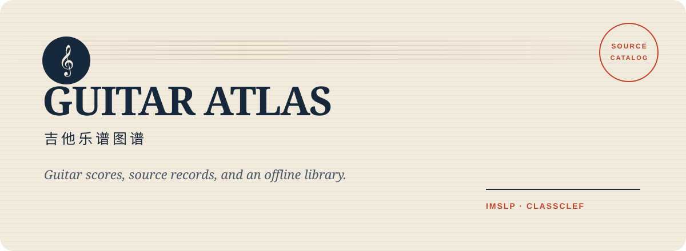

<p align="center">
  
</p>

<p align="center">
  <a href="https://lin-qian123.github.io/guitar-atlas/"><strong>在线检索</strong></a>
  · <a href="README.en.md">English</a>
  · <a href="#快速开始">快速开始</a>
  · <a href="#整理与检索方法">整理方法</a>
</p>

<p align="center">
  
  
  
  
</p>

**Guitar Atlas（吉他乐谱图谱）**是面向多个来源的吉他乐谱目录与本地离线库。目前整理 [IMSLP](https://imslp.org/) 与 [ClassClef](https://www.classclef.com/) 的数据，提供来源、曲名、音乐家和分类检索，并为后续增加其他网站保留独立的来源适配层。

项目分别保留来源中的作品身份、版本与分类信息；同名曲目在不同网站上的记录不会自动合并。原始曲名与音乐家署名始终保留，已审校的中文参考名用于辅助检索。旧项目名 `imslp-guitar` 已更名为 `guitar-atlas`，既有磁盘目录无需随仓库更名迁移。

## 两种版本

| 版本 | 用途 | 乐谱入口 |
| --- | --- | --- |
| **公开网站** `public_site/` | GitHub Pages 在线检索与来源导航 | 链接到来源网站的作品页或目录页 |
| **本地离线库** 根目录生成页 | 在保存完整资料的电脑或硬盘上浏览 | 链接已验证的本地 PDF，并保留来源页 |

两种版本共用页面模板、样式和搜索逻辑。公开网站不托管乐谱，也不包含 PDF、MIDI、GPX、下载地址、本地路径、文件哈希或私有运行元数据。Git 仅跟踪程序、配置、审校资产和不含乐谱文件的公共目录。

## 当前来源与范围

| 来源 | 组织方式 | 核验边界 |
| --- | --- | --- |
| **IMSLP** | 经批准的古典/原声吉他独奏、重奏与吉他室内乐精确编制分类 | 原作与改编分开；文件须符合指定编制分区；保留原分类名 |
| **ClassClef** | 按来源站曲目和音乐家目录整理，单独保留来源分类 | 收录公开目录中的乐谱记录及可验证下载的 PDF；未明确的编制、原作/改编不推测；中文参考名另行审校 |

### 中文目录修复：2026-09-29

| 来源 | 中文曲名（参考译法或惯用名） | 明确保留原题 | 音乐家中文名 / 有署名的不同名称 | 中文分类 |
| --- | ---: | ---: | ---: | ---: |
| IMSLP | 11,380 | 13 | 2,158 / 2,164 | 352 / 352 |
| ClassClef | 6,664 | 76 | 851 / 858 | 77 / 77 |

ClassClef 的 6,740 条曲名均已逐条处理；76 条保留原题并记录原因，其中 2 条仍有中文改编说明，不能把“含中文字段”直接当成完整译名。7 个来源署名保留原文，另 4 条记录在来源中没有署名。IMSLP 修正 92 条曲名及一批音乐家误译；其余曲名沿用历史参考审校资产，本次不宣称所有名称已有权威中文定名。

两种版本统一应用按来源与稳定 ID 保存的译名。新条目缺少审校、原文或 ID 漂移、汇总过期会阻止发布；重新采集不会用机器草稿覆盖已有复核结果。详细状态与保留原因见 [`coverage_2026-09-29.json`](metadata/translations/coverage_2026-09-29.json)。本次译名审计无未复核草稿或漏译字段；有意保留的原文独立统计。

849 项 Python 测试、34 项 Node 搜索测试、公开隐私验证与译名审计通过；浏览器核对中文曲名、人名、分类筛选及原题保留标签。公开/离线显示逐字段一致，31,143 个本地 PDF 路径与 6 条排除规则核对通过。

本次同步公开目录、本地总页和 352 个旧分类目录的显示文字。本地总页通过清单、排除规则、归属、链接与文件大小核对更新，保留前次文件完整性结果；未重新执行全库 PDF 哈希与解析验证。下列 2026-09-28 文件覆盖缺口和编制待核验项仍然存在。

### 2026-09-28 目录快照

| 来源 | 来源记录 | 分类 | 分类关系 |
| --- | ---: | ---: | ---: |
| IMSLP | 11,393 | 352 | 12,548 |
| ClassClef | 6,740 | 77 | 7,025 |
| **合计** | **18,133** | **429** | **19,573** |

ClassClef 包含 **6,739 条乐谱记录及 1 条参考资料**。冻结的 5,937 篇帖子与 126 个页面共计 6,063 条 API 记录、6,062 个不同网页；12,648 条原始来源行和 23,152 个格式链接均完整保留。来源记录数不等于跨站唯一乐曲数。

- **文件覆盖**：8,521 个 PDF/ZIP 来源链接中，8,290 个已取得并验证（含既有 IMSLP 文件复用），231 个重试后仍为 HTTP 404；无待下载、临时失败、损坏文件或访问阻挡状态。
- **本地内容**：ClassClef 对应 8,578 个不同内容 PDF，约 5.535 GB，其中 8,577 个本源对象、1 个既有 IMSLP 文件复用。320 个谱包中，304 个成功展开为 638 个 PDF 成员；成员数尚未按内容去重。这些不是全库新增独有 PDF 数。
- **可用性**：2 条记录仅有 GPX/MIDI，68 条有 PDF 来源但全部失败，共 70 条暂无本地 PDF；另有 127 条仅部分版本可用。

ClassClef 最终全量文件验证通过：8,578 个清单对应文件全部复核，`structural_valid=true`，错误与隔离记录均为空。231 个真实 404 使 `complete=false`、验证命令返回 2，表示来源覆盖仍有缺口；MIDI/GPX 仅索引元数据。

全库离线页已重新生成并核验：

| 来源 | PDF 清单记录 | 有效记录 | 不同内容 SHA-256 |
| --- | ---: | ---: | ---: |
| IMSLP | 22,637 | 22,566 | 21,496 |
| ClassClef | 9,088 | 8,855 | 8,578 |
| **全库** | **31,725** | **31,421** | **29,904** |

全库保留 **304 条未就绪记录，其中包括 6 条明确排除**；IMSLP 为 65 条旧未就绪及 6 条编制排除。链接终验通过：31,143 个不同本地路径对应 30,974 个被链接的 inode，未发现失效或违规排除链接。29,904 是不同文件内容数，不是物理实体数；既有 IMSLP 重复实体尚未全库去重。跨来源实核已将 169 份重复副本改为共享硬链接，节省 **60,879,123 字节**；另 2 个候选因 IMSLP 源文件核验不符而保留 ClassClef 原件。

741 项 Python 测试、32 项 Node 搜索测试及公开隐私验证通过；由最终来源元数据重建的公开目录与已导出文件逐字段一致。浏览器检查覆盖五分谱展开、无 PDF/404 提示、编制排除及参考资料，JavaScript 错误为 0；样本 PDF 的 HTTP 响应与实际渲染检查通过。Codex 内置浏览器的 PDF 预览为空，因此不将该预览器列为通过项。

目录快照 [`502db86`](https://github.com/lin-qian123/guitar-atlas/commit/502db8610994a32716ea5bda59eabe965b2c2fb3) 已发布至 [GitHub 仓库](https://github.com/lin-qian123/guitar-atlas) 与 [在线目录](https://lin-qian123.github.io/guitar-atlas/)，[测试与部署工作流](https://github.com/lin-qian123/guitar-atlas/actions/runs/36409900823)成功；线上文件摘要与本地匹配。IMSLP 的 11,393 个中文曲名审校资产继续保留，后续缺口与接续说明见 [TODO.md](TODO.md)。

IMSLP 的精确编制规则只适用于该来源，不能据此把 ClassClef 的目录标签解释为经过核验的编制。目录范围以本次冻结的来源快照为准，上游新增、删除和链接失效单独记录。

**本轮 IMSLP 编制核验边界**：来源分区明确包含额外低音乐器的 6 条记录，已按来源、分类、`work_id` 和文件名精确审查，写入 [`config/score_exclusions.json`](config/score_exclusions.json)，从新版离线文件链接中排除；原文件保留。两个受影响分类的旧详细页暂不再由新版页面链接。另有 **495 条 `Work-level target-guitar score` 记录和 33 条其他分区候选**尚待逐文件核实精确编制。本轮不能据此宣称全库编制纯度已重新通过验证；PDF 可解析及哈希正确也不证明编制正确。

## 整理与检索方法

### 来源身份与分类

每个来源记录由来源和来源内 ID 共同标识；公开数据中的字段为 **`source_id` + `source_record_id`**。IMSLP 继续保留原 `work_id`；同一来源作品的多个分类关系合并展示。跨站的相似标题、作曲家名或文件名只可用于检索，不足以认定作品、改编版本或文件相同。

IMSLP 纯吉他范围由 [`config/categories.json`](config/categories.json) 指定，吉他与其他乐器及室内乐范围由 [`config/mixed_categories.json`](config/mixed_categories.json) 指定。排除电吉他、贝斯、夏威夷/钢棒/滑棒吉他、人声/合唱、电子/磁带、大型乐团，以及吉他仅为 `or` 备选的独奏分类。混合编制按弦乐、木管、铜管、键盘/自由簧、拨弦、打击乐和混合室内乐分组。

原作分类只接受原作谱和分谱；`(arr)` 分类只接受页面 `FILES` 中完整匹配目标编制的分区。Unicode 与页面标记清理后执行锚定匹配，避免把附加人声、低音或其他乐器的编制误收。

ClassClef 保留其曲目原名、音乐家署名、来源页和目录归属。来源未说明的信息显示为未标注；不会根据站点名称、曲名或链接推断原作/改编、难度或乐器数量。未审校的中文曲名不会冒充已审校译名。

来源链接优先使用已证实存在的独立曲目页；没有独立页面时使用已确认的目录页。错误或过时的原始 `INFO` 链接保留在内部来源记录中，不作为公开入口。

仅提供 Guitar Pro 等格式而没有 PDF 的曲目仍保留来源与格式信息；术语表等参考资料单独标注。乐谱记录、参考资料和已验证本地 PDF 分别统计，无可用 PDF 时不生成本地谱面链接。

### 数量与文件验证

以下指标分别统计：

- **分类关系**：一条来源记录属于一个分类，记一条。
- **来源记录**：按来源和来源内 ID 去重；不宣称已跨站完成音乐学意义上的作品去重。
- **清单记录**：某分类或来源记录下的一份文件条目；同一文件可以出现在多个条目中。
- **不同 PDF 内容**：按内部 SHA-256 去重；路径数、被链接的 inode 数另行统计，保留全部来源署名和分类路径。

下载使用可恢复流程和原子 `.part` 文件。验证检查 PDF 文件头、预期字节数与来源校验和（如提供）、SHA-256 和可解析性；HTML、登录页、CAPTCHA、错误页和不完整响应均不能作为乐谱入库。来源未提供独立校验和时，内部哈希只证明本地内容一致，不能冒称与上游官方哈希核对完成。需要人工验证时保留未完成状态。

### 搜索与参考译名

首页按分类浏览；选择具体分类或输入关键词后显示来源记录。搜索覆盖原始/中文曲名、原始/中文音乐家名、分类与来源信息。大小写、重音符号、常见标点、部分繁简字和 `Op.9` / `op9` 等写法会规范化；多关键词全部保留，编号按完整数字匹配。

搜索别名存放于 [`public_site/data/search-aliases.json`](public_site/data/search-aliases.json)，仅辅助检索。精确与别名匹配均无结果时才尝试保守拼写容错，并明确标注近似结果。输入建议、近似结果及作品的分类展示遵守当前筛选条件，检索状态可通过 URL 恢复。所有匹配在浏览器内运行，不将关键词发送给外部搜索或 AI 服务。

IMSLP 曲名审校的权威文件是 [`metadata/translations/title_overrides_reviewed_zh.json`](metadata/translations/title_overrides_reviewed_zh.json)，按 `work_id` 优先于机器翻译缓存。来源原文始终保留；中文名是参考译名，未审校或未提供的名称如实标注。

ClassClef 曲名保存在 [`classclef_titles_zh.json`](metadata/translations/classclef_titles_zh.json)，按完整来源 ID 定位；音乐家和分类分别保存在 [`musicians_zh.json`](metadata/translations/musicians_zh.json) 与 [`categories_zh.json`](metadata/translations/categories_zh.json)，按来源分开维护。重新采集不会清空这些译名；原文改变或 ID 失效时，导出会停止并要求复核。

每个曲名、署名和分类分别记录状态、依据与原因：`reviewed` 为有依据的惯用名，`reference` 为已对照原文检查的参考译法，`retained` 为有具体理由保留的原文。未经检查的草稿为 `machine`，未译为 `untranslated`；来源本就没有署名时使用 `not_applicable`。中文字段非空不等于权威译名，也不代表编制或文件已核验。编号式标题、风格化品牌，以及无法可靠确认中文用字的姓名可以保留原文，不虚构译名以凑覆盖率。

`python scripts/audit_translations.py` 分别统计中文覆盖、参考译法、惯用名、原文保留和缺失署名；未复核草稿或漏译会阻止发布。曲名草稿可用 `python scripts/build_classclef_translations.py draft` 续传，`shards` 输出审查分片；复核后使用 `assemble` 汇入持久资产，已有复核结果受到保护。机器缓存与临时审查分片位于 Git 忽略的 `work/`，最终资产进入版本管理。

## 快速开始

### 浏览公开目录

仓库已包含生成的公开目录，无需下载乐谱文件：

```bash
git clone https://github.com/lin-qian123/guitar-atlas.git
cd guitar-atlas
python -m http.server 8000 --directory public_site
```

打开 <http://127.0.0.1:8000>。已有 `imslp` 本地目录可继续原地使用，目录名称不影响来源身份。

### 安装与检查

```bash
python -m venv .venv
source .venv/bin/activate
python -m pip install -e '.[test]'
python -m pytest -q
node --test tests/search.test.cjs  # Node.js 22+，无需 npm 依赖
python scripts/validate_public_site.py public_site
python scripts/audit_translations.py
```

### 采集与验证 ClassClef

配置位于 [`config/classclef.json`](config/classclef.json)。分步流程可在中断后继续：

```bash
python scripts/build_classclef_library.py --root . discover
python scripts/build_classclef_library.py --root . download
python scripts/build_classclef_library.py --root . verify
# 或依次运行全部步骤
python scripts/build_classclef_library.py --root . all
```

来源快照、规范化目录、下载状态和验证报告保存在 `sources/classclef/`，PDF 对象位于其 `objects/` 子目录。该目录不会进入 Git；公开版从规范化元数据中选取允许发布的字段。`verify` 的结果决定本地文件是否可用，发现条目数量不能代替成功下载数量。

### 共享跨来源的相同 PDF

停止 ClassClef 下载后、最终验证前，先预览再执行：

```bash
python scripts/deduplicate_source_pdfs.py --root .          # 默认只预览
python scripts/deduplicate_source_pdfs.py --root . --apply  # 执行物理去重
python scripts/build_classclef_library.py --root . verify
```

仅当 ClassClef 文件与已批准范围内的 IMSLP 文件经本次 SHA-256、IMSLP 源 SHA-1、大小和 PDF 解析检查确认完全相同时，才以原子硬链接替换 ClassClef 对象，使双方共享物理文件；两边路径、元数据和原始字节保持不变。仅匹配元数据的候选不算去重完成。`all` 采集流程不代替这一步；执行去重后需再次验证。


### 重新导出公开目录

在拥有来源目录元数据的完整资料目录运行；导出只读取元数据，不复制乐谱文件：

```bash
python scripts/export_public_site.py \
  --root . \
  --output public_site/data/catalog.json
```

导出与验证会拒绝身份冲突、目录缺失或结构错误、未批准来源的页面链接，以及可能泄露本地或下载信息的字段。导出后重新运行 Python、搜索、公开站点验证与译名审计，再发布 `public_site/`。

### 重建本地离线总页

```bash
python scripts/render_master_index.py .
```

这条命令会检查本地 PDF 的文件头、大小、源 SHA-1（如有）和可解析性，并生成根 `index.html`。旧入口保存在 `backups/offline-ui/`。

仅修改译名或显示文案时，可运行 `python scripts/render_master_index.py . --metadata-only`。此模式比较来源身份、清单、范围与排除规则，并核对全部现有链接及文件大小后更新页面；清单或文件状态改变时拒绝继续，需完整重建。它保留上次 PDF 完整性结果，不重新证明文件哈希或可解析性。

可选安装 Poppler（macOS：`brew install poppler`）。当 pypdf 无法读取某些旧式 PDF 时，生成器可使用 `pdfinfo` 交叉验证；不会修改或修复原文件。

离线总页复用 `public_site/` 的页面模板、样式和搜索引擎，首页同样按分类浏览。目录与搜索别名嵌入页面，直接双击根 `index.html` 即可使用，无需服务器；请保留仓库的相对目录结构。作品卡片按当前分类显示本地总谱、分谱和未就绪提示，同时保留来源入口。未受排除审查影响的原有分类详细页仍可通过“分类完整目录”打开。

**GitHub 保存代码，不保存离线库实例**：公开页面、共享样式、离线生成脚本和适配代码会进入仓库；根 `index.html`、分类目录、本地路径数据、备份和 PDF 均被 Git 忽略。GitHub Pages 只部署 `public_site/`，不会部署离线页面。离线页面复制的地址是当前电脑的本地位置，对外分享请使用公开网站链接。

## 增加来源

来源注册表为 [`config/sources.json`](config/sources.json)，共同数据契约及公开字段投影位于 [`scripts/catalog_sources.py`](scripts/catalog_sources.py)。来源适配器负责发现、解析、下载和验证，规范化目录由 `normalized_catalog` 适配类型接入。新增网站时需定义稳定的来源 ID 和来源内记录 ID、批准的范围、原始署名字段及页面 URL，并记录可恢复的快照与失败状态。来源特有的分类、版本及原作/改编信息应明确映射；缺失信息保留未知。不可把 IMSLP 的规则、中文名审校状态或跨分类身份假设直接套用到其他网站。

新来源必须接入同一公开字段白名单、来源 URL 校验、本地文件验证和搜索测试。相同内容的 PDF 可按 SHA-256 复用物理对象，但每个来源记录及署名保持独立。新增网站不需要重命名项目；现有 `scripts/imslp_library/` 保留为 IMSLP 适配器的模块名称。

## 项目结构

```text
guitar-atlas/
├── config/                         # 来源范围、IMSLP 分类与逐文件排除审查
├── sources/classclef/              # 私有快照、清单、验证与 PDF（Git 忽略）
├── metadata/translations/          # 按来源维护的曲名、音乐家和分类译名与审校证据
├── public_site/                    # 可部署的来源目录，不含乐谱文件
│   ├── assets/                    # 共享样式、交互与搜索引擎
│   ├── data/catalog.json           # 按来源身份合并分类关系的公开目录
│   ├── data/search-aliases.json    # 仅供检索使用的别名
│   └── index.html
├── scripts/
│   ├── catalog_sources.py          # 来源注册与公共数据契约
│   ├── build_classclef_library.py   # ClassClef 发现、下载、验证
│   ├── deduplicate_source_pdfs.py   # 已验证相同 PDF 的跨来源物理去重
│   ├── export_public_site.py       # 多来源元数据 → 公开目录
│   ├── audit_translations.py       # 译名覆盖与逐字段审校状态门禁
│   ├── validate_public_site.py     # 发布前数据与隐私检查
│   ├── render_master_index.py      # 本地离线总页
│   ├── render_offline_site.py      # 公共模板与离线数据适配
│   ├── assets/                    # 仅用于离线页面的适配代码
│   └── imslp_library/              # IMSLP 来源适配器
├── tests/
├── AGENTS.md
├── TODO.md
├── DATA_LICENSE.md
└── THIRD_PARTY_NOTICES.md
```

## 数据与版权边界

Guitar Atlas 是独立目录项目，不隶属于 IMSLP 或 ClassClef，也不代表这些网站。公开网站只链接来源页面。第三方谱面、录音、页面内容及元数据可能有各自的授权条件；本站收录、提供免费下载或保存本地副本，都不表示相关内容已进入公有领域或允许再分发。各文件保留其来源及自身的版权、许可说明。

- 程序代码：[MIT](LICENSE)
- 项目原创目录结构、参考译名、文档和视觉资产：[CC BY-SA 4.0](DATA_LICENSE.md)
- 来源与第三方说明：[THIRD_PARTY_NOTICES.md](THIRD_PARTY_NOTICES.md)

本项目的开放许可不覆盖第三方乐谱，不授予对它们的额外使用或再分发权利。
